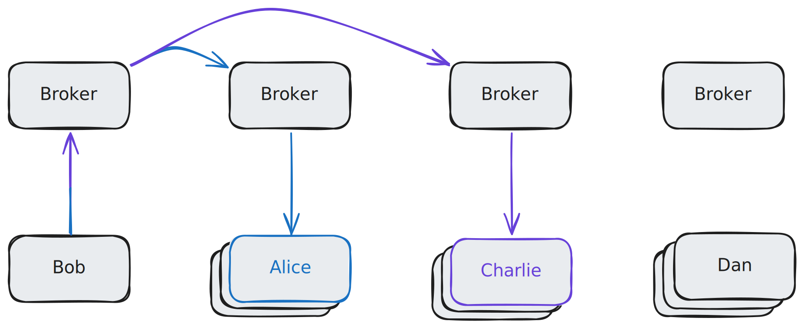

# The Push-CDN

The Push-CDN is a distributed and fault tolerant messaging system built to accelerate peer-to-peer networks. It does this by keeping track of the network topology, which enables it to route messages more efficiently than traditional gossip-based protocols.


_Bob wants to broadcast an identical message to two of his close friends, Alice and Charlie. The CDN knows where each friend is located, so the message is routed to them directly and no other users (like Dan) receive the message as a consequence._

## Feature highlights
- Fast, reliable, and efficient
- Support for both publish-subscribe and direct messaging models
- First class support for routing and authentication on top of public-key cryptosystems

## Examples
A client example using `jellyfish` keys is available [here](./cdn-client/src/binaries/client.rs)

## Running locally
Running locally can be achieved via the supplied `process-compose.yaml`:
```bash
process-compose up
```

It requires installation of `KeyDB` or `Redis`.

## License
### Copyright
**(c) 2024 Espresso Systems**.
`Push-CDN` was developed by Espresso Systems. 
